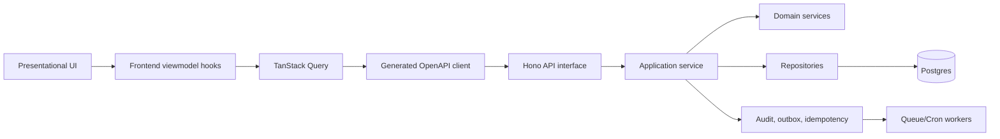

# Overall Plan

## Goal

Build a Workers-native backend for Golden Years that can replace the mockup's localStorage/data-service layer with durable, audited, authorization-safe API contracts. The backend should let the React app remain UI-reflective without letting UI components own product logic.

## How Things Connect

The API is the hard boundary between UI-reflective surfaces and production logic. The frontend can adapt the mockup visually because all authoritative rules sit behind generated DTOs, viewmodels, and backend services.

## Build Phases

### BE0: Foundation

- Cloudflare Worker app with Hono routing.
- Zod schemas and OpenAPI generation.
- Standard envelopes, errors, request IDs, CORS, CSRF hooks, logging, and rate-limit metadata.
- Postgres migrations, Kysely DB access, seed imports, and public projections.
- Idempotency, audit, outbox, and transaction helpers.
- Claude API-conventions skill and Codex symlink rule.

### BE1: Public Marketplace

- Reference data.
- Public homepage, search, facility detail, reviews, articles, recommendations, and analytics ingestion.
- Facility card/detail/map projections shaped for frontend React Query use.
- Postgres full-text, trigram, filter DSL, and PostGIS map search.

### BE2: Family Workflow MVP

- Signup, login, logout, email verification, password reset, and current user.
- Saved facilities.
- Tour request lifecycle with idempotency and notifications.
- Account dashboard, review eligibility, and verified review submission.
- Notification inbox snapshots.

### BE3: Operations Pilot

- Provider onboarding submission and draft autosave.
- Media upload authorization and R2 asset persistence.
- Facility manager dashboard, availability, tour actions, review responses, and bounded listing edits.
- Admin listing review, licence verification, disable/enable, review flag resolution, CMS articles/static pages, and audit query tools.

### BE4: Decision Tools And Growth

- Compare aggregates.
- Assessment schema versions, scoring, persistence, and matched facilities.
- Cost-calculator policy versions and reproducible calculations.
- Owned and shared shortlists with participants, reactions, notes, share tokens, and import-copy flow.
- Analytics rollups, recommendation attribution, bounce/complaint webhooks, retention jobs, and operational dashboards.

## State Ownership

| State kind | Owner | Examples | API responsibility |
| --- | --- | --- | --- |
| Source of truth | Postgres | users, facilities, tours, reviews, submissions, articles | transactional persistence |
| Public projections | Postgres views/tables | search cards, detail summaries, map markers | no per-card waterfalls |
| Server state cache | TanStack Query in frontend | facility search, account dashboard, admin queues | stable operation IDs and invalidation tags |
| Route state | Frontend URL codecs | search filters, map bounds, article category | accept standard body filters |
| Workflow state | Backend application services | tour transitions, listing approval, review eligibility | validate and audit transitions |
| Side effects | Outbox + Queues | email, notifications, search sync, rollups | never best-effort inside only memory |
| External objects | R2 and adapters | media originals, public variants | store metadata and permissions in Postgres |

## Implementation Biases

- Pick Kysely for the DB layer because the app needs complex SQL, PostGIS, projections, and reporting queries.
- Pick application-owned sessions because roles, memberships, guest claims, audit, and workflow authorization are backend-owned anyway.
- Pick R2 for v1 media because it fits Workers and cost goals; leave Cloudinary as a future adapter if transformations become the bottleneck.
- Pick Resend as the first email adapter unless procurement or data residency pushes the team to Brevo/SES.
- Keep Postgres search for v1 and make Meilisearch/Typesense a replaceable projection consumer later.

## Mockup Reflective Loop

1. Extract product intent from `golden-years-mockup/API_REQUIREMENTS.md`.
2. Convert old REST-ish examples into `API_CONVENTIONS.md` operations.
3. Define OpenAPI schemas and operation IDs.
4. Generate the frontend client and React Query hooks.
5. Implement backend BDD scenarios against the API boundary.
6. Let frontend viewmodels adapt mockup screens using generated contracts.
7. Treat drift as contract drift, not UI code improvisation.
