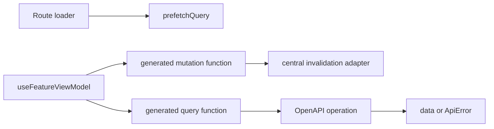

# React Query Contract

## Purpose

TanStack Query is a frontend implementation detail, but the backend contract must be designed so the frontend can use it without leaking product logic into UI components. The generated client, query keys, cache invalidation, error mapping, and optimistic-update rules depend on backend consistency.

## Backend Responsibilities

### Stable Operation IDs

Each OpenAPI operation uses the endpoint name as `operationId`.

```yaml
operationId: search_facilities
```

This lets generated hooks/query functions, query key factories, logs, and BDD tests use the same name.

### Projection-Complete Responses

Read operations must return DTOs that are complete for the target UI surface:

- Facility card summaries include price display inputs, rating counts, verified review count, availability freshness, region, care types, features, languages, image, and save decoration when authenticated.
- Search responses include map marker data with the same result set.
- Account dashboard returns aggregate counts and summaries in one call.
- Admin queues return actor-safe summaries and status metadata.

The frontend should not perform per-card waterfalls to reconstruct a UI state.

### Query Key Inputs

List/search bodies must be canonicalizable:

- `filters`
- `sort`
- `page`
- `fields`

The frontend query key factory can hash canonical JSON using these fields plus operation ID and principal scope.

### Error Codes

Errors use stable codes that viewmodels can map into states:

```text
bad_request
unauthenticated
forbidden
*_not_found
conflict
validation_failed
rate_limited
internal_error
```

Feature-specific errors should remain snake_case and documented in the OpenAPI response schema.

### Mutation Invalidation Metadata

Every mutation operation declares the resource tags it invalidates. Use OpenAPI extensions:

```yaml
x-goldenyears-invalidates:
  - facility
  - facility:{id}
  - tour_request
```

Generated frontend adapters can map these tags to query invalidation helpers. Start coarse, then add fine-grained tags where churn hurts.

### Idempotency

Duplicate-prone creates support an `Idempotency-Key` header:

- `create_tour_request`
- `create_listing_submission`
- `create_review`
- `create_shortlist_share`
- media upload initiation operations
- payment-like or irreversible future operations

React Query mutations can retry safely only when the backend honors idempotency.

## Frontend Consumption Pattern



Frontend rules supported by the backend contract:

- UI components receive viewmodel props and commands only.
- Viewmodels call generated API/query functions.
- Query keys are generated or centralized, not hand-rolled in UI components.
- Mutations invalidate or patch by backend-declared resource tags.
- Optimistic updates are used only when rollback and `409 conflict` handling exist.
- Infinite queries are used for search, reviews, articles, notifications, and admin queues where pagination matters.

## Server Cache And React Query Cache

These are different caches:

- Server cache is opt-in via `API_CONVENTIONS.md` cache allowlist.
- React Query cache is per-browser server-state memory.

The backend should not rely on frontend cache for correctness. The frontend should not assume server reads are cached unless OpenAPI metadata documents it.

## Contract Checks

Build-time contract checks should verify:

- All OpenAPI operation IDs equal endpoint names.
- All operations use `POST`.
- No operation has path or query parameters.
- Success and error envelopes are modeled.
- List/search endpoints use the standard body shape.
- Mutations include invalidation metadata.
- Duplicate-prone creates include `Idempotency-Key` support.
