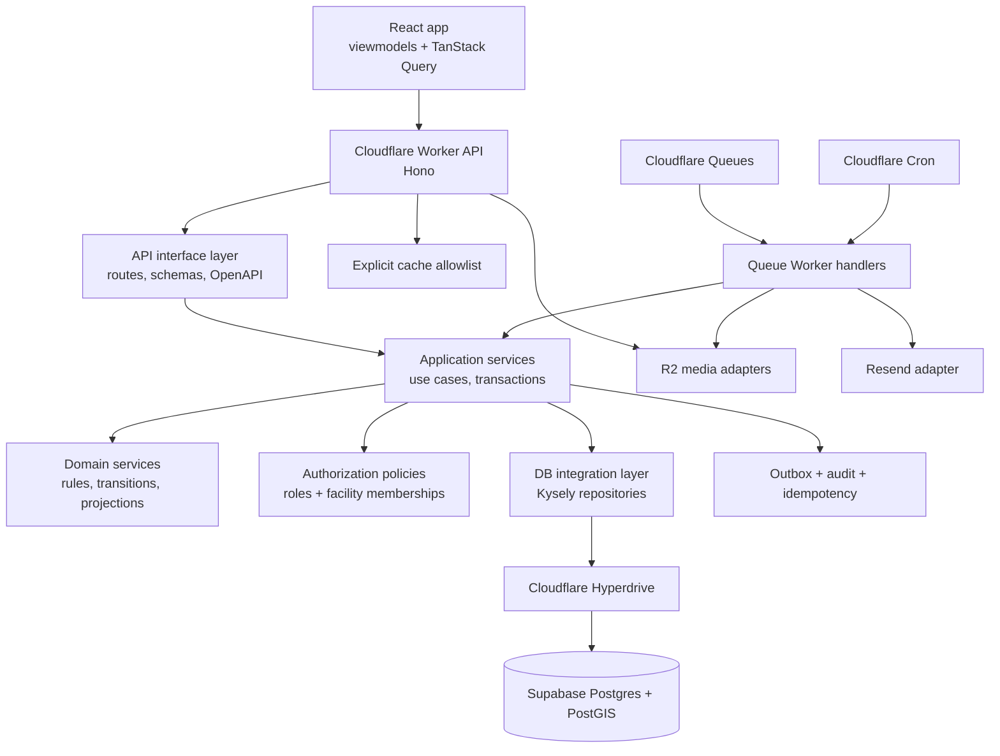

# Golden Years Server Next Blueprint

This folder is the build blueprint for the next-generation Golden Years backend. It turns `BE_TECH_STACK.md`, `API_CONVENTIONS.md`, and `golden-years-mockup/API_REQUIREMENTS.md` into an agent-ready implementation plan with one cohesive design choice: the backend owns all product logic, state transitions, authorization, data shaping, audit, and side effects, while the frontend consumes stable OpenAPI operations through a fully encapsulated query/viewmodel layer.

The selected v1 stack is TypeScript, Cloudflare Workers, Hono, Zod, OpenAPI, Supabase Postgres in Singapore, Hyperdrive, Kysely with SQL migrations, Postgres-first search with PostGIS, Cloudflare R2, Cloudflare Queues and Cron, and application-owned session auth.

## Required Context Bundle For Agents

Every implementation agent receives README + one step plan. Never less.

1. `golden-years-server-next/README.md`
2. The specific step plan, such as `golden-years-server-next/05-public-marketplace-apis.plan.md`

The README is the source of truth for whole-system architecture, shared vocabulary, naming, boundaries, React Query contract, and safety rules. Each step plan is the second file and stays narrow.

Supporting blueprint docs in this folder are useful for leads and reviewers, but a step agent must be able to execute from this README and its assigned plan alone.

## Architecture



## Proposed Source Shape

```text
apps/
  api/
    src/
      entrypoints/
        http.ts
        queue.ts
        cron.ts
      interface/
        routes/
        schemas/
        openapi/
        middleware/
      application/
        auth/
        facilities/
        tours/
        reviews/
        onboarding/
        admin/
        cms/
        assessment/
        shortlists/
        analytics/
      domain/
        availability/
        pricing/
        tour-state/
        review-eligibility/
        listing-workflow/
        cost-policy/
        recommendations/
      db/
        schema/
        migrations/
        repositories/
        projections/
        seeds/
      platform/
        cache/
        email/
        geocoding/
        media/
        queue/
        rate-limit/
      shared/
        audit/
        authz/
        config/
        errors/
        filters/
        idempotency/
        logging/
        pagination/
        request-context/
        testing/
packages/
  api-contract/
  test-fixtures/
  db-schema/
tools/
  openapi/
  seed-import/
  migrations/
  contract-checks/
```

## Suggested Step Order

1. `01-worker-foundation-and-api-interface.plan.md`
2. `02-database-schema-migrations-and-repositories.plan.md`
3. `03-cross-cutting-service-primitives.plan.md`
4. `04-auth-rbac-sessions.plan.md`
5. `05-public-marketplace-apis.plan.md`
6. `06-family-workflows-apis.plan.md`
7. `07-provider-onboarding-media-and-facility-manager.plan.md`
8. `08-admin-moderation-cms-and-audit.plan.md`
9. `09-decision-tools-shortlists-assessment-cost.plan.md`
10. `10-async-notifications-analytics-and-ops.plan.md`

Order is recommended. Each plan defines its own scope, BDD contract, non-goals, and acceptance criteria.

## Shared Vocabulary

- `API interface layer`: Hono routes, middleware, request/response schemas, and OpenAPI metadata. No business rules beyond request validation and envelope conversion.
- `Application service`: a use case function that owns orchestration, transactions, idempotency, audit, outbox writes, and calls to repositories/domain services.
- `Domain service`: pure or mostly pure business rules with no Hono, database, queue, React, or platform imports.
- `DB integration layer`: Kysely repositories, SQL migrations, projections, and seed importers. It owns SQL details and row mapping.
- `Platform adapter`: R2, email, queue, geocoding, cache, rate limit, clock, ID generation, and environment access behind narrow ports.
- `Projection`: read-optimized shape used by APIs and React Query, such as facility cards, map markers, inbox rows, and admin queues.
- `Endpoint operation`: one `POST /api/v1/{verb_resource}` operation following copied `API_CONVENTIONS.md`.
- `Envelope`: success `{ "data": ... }` or failure `{ "error": ... }`.
- `UI-reflective`: the mockup informs product surfaces and visual behavior, but production logic lives in backend services and frontend viewmodels, never in presentational UI.
- `Contract-backed frontend`: React Query and viewmodels consume `api.*` facade methods backed by generated OpenAPI contract types. UI components never branch on backend envelopes or raw roles.

## React Query Contract

The backend does not import React Query, but it is responsible for making React Query safe and boring to use:

- Every endpoint has a stable OpenAPI `operationId` matching the endpoint name, such as `search_facilities` or `create_tour_request`.
- Read endpoints return projection-complete DTOs so the frontend avoids per-card waterfalls.
- List/search endpoints support the standard body shape: `filters`, `sort`, `page`, and `fields`.
- Errors use stable snake_case codes that viewmodels can map to loading, empty, unauthorized, forbidden, conflict, rate-limited, and generic error states.
- Duplicate-prone creates support `Idempotency-Key`.
- Mutation operations declare invalidation tags in OpenAPI extensions, such as `facility`, `tour_request`, `review`, `notification`, `submission`, `shortlist`, `assessment`, and `cost_estimate`.
- Cacheable reads are opt-in only and follow the allowlist in `API_CONVENTIONS.md`.

## Shared Safety Rules

- API endpoints use `POST` and JSON only. No path params and no query params.
- Auth, tenant, role, actor, and facility membership are derived server-side from the session or token. Never trust actor identity from a request body.
- Public responses never expose provider contact emails, admin notes, audit trails, moderation state, private media originals, or facility manager metadata.
- Every mutation touching business state runs inside an explicit transaction that includes the business change, audit record, idempotency result when applicable, and outbox event when applicable.
- Every privileged action requires an authorization policy check backed by roles or facility memberships.
- Assessment answers, tour requests, contact details, care urgency, review bodies, provider licence data, and cost-calculator inputs are sensitive. Do not log raw payloads.
- State transitions are single-purpose endpoints. Do not overload one endpoint by inspecting a generic `action` field.
- External providers are accessed only through platform adapters.
- SQL migrations are run outside the Worker runtime.
- Production Postgres access is via Hyperdrive only. Hyperdrive origin must be Supabase **session pooler** (`*.pooler.supabase.com:5432`). Transaction pooler (`:6543`) causes DB routes to hang with `pg`/Kysely. See `docs/deployment/environment-variables.md`.
- Codex-facing skills must be symlinks to canonical Claude skills under `.claude/skills`. Do not put standalone `SKILL.md` files under `.codex/skills`.

## Working Pattern

- Plan first. Implement second.
- Write failing tests for the BDD scenarios in the assigned plan before implementation.
- Define public boundary types before internals when another module, OpenAPI contract type, frontend viewmodel, test, or agent will consume them.
- Keep API interface, application, domain, DB integration, and platform adapter boundaries clean.
- Stop at each plan's acceptance criteria. Do not silently expand scope.
- Track implementation notes in sibling `NN-*.progress.md` files.
